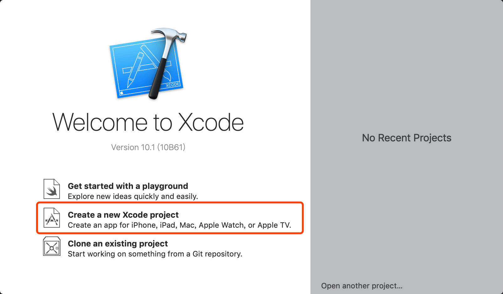

# 第二章 对 C 的扩展

## 2.1 最简单的 OC 程序
1. 打开 Xcode，选择 "Create a new Xcode project" 进入创建新项目流程：


2. 如图所示选择创建一个命令行程序：


3. 填写一些项目相关信息（目前可以暂时随意填写）：


4. 在磁盘上选择一个位置保存项目文件：


5. 项目创建成功之后的状态如下图：


6. 点击 Xcode 的三角形按钮使程序跑起来，可以在 Xcode 输出结果处看到打印了 "Hello, World!"：


## 2.2 解读 Hello World 程序
```Objective-C
//
//  main.m
//  ios-study-02-01
//
//  Created by roryluo-mb on 2019/5/29.
//  Copyright © 2019 ios-study. All rights reserved.
//

#import <Foundation/Foundation.h>

int main(int argc, const char * argv[]) {
    // @autoreleasepool 在 09-内存管理 章节会讲到
    @autoreleasepool {
        // insert code here...
        NSLog(@"Hello, World!");
    }
    return 0;
}
```

### 2.2.1 #import
在 C 中使用 `#include` 来导入其他文件，在 OC 中使用 `#import` 来导入其他文件，不同点在于 `#import` 可以保证文件不被重复导入。

`#import <Foundation/Foundation.h>` 的意思是告诉编译器查找 `Foundation` 框架中的 `Foundation.h` 文件。

通过在主文件的头部使用 `#import` 来使用框架提供的功能。

### 2.2.2 框架
框架是一种把头文件、库、图片、声音等内容聚集在一个独立单元的集合体。苹果公司将 Cocoa、Carbon、QuickTime 和 OpenGL 等技术作为框架来提供。

Cocoa 的组成部分有 `Foundation` 和 `AppKit`。

顺便插一句，图片、动画的支持是 `Core Image`、`Core Animation` 框架支持的。

### 2.2.3 NSLog 和 @"字符串"
使用 `#import` 导入 `Foundation` 头文件之后就可以开始利用 `Foundation` 特性来编写程序了。`NSLog` 类似 C 语言的 `printf` ，可以输出字符串。

OC 没有命名空间的概念，为了防止符号冲突，可以看到来自 `Foundation` 的 API 都具有 `NS` 前缀，这个前缀的意义是来自 `NextSTEP`（可以参考 01-启程 1.2 部分）。

`@"字符串"` 是 `NSString` 类型的字面量，这样的写法是为了与 C 字符串做区分。

### 2.3 布尔类型
* C 有布尔类型 bool，具有 `true` 和 `false` 两个值
* OC 也提供了相似的类型 BOOL，具有 `YES` 和 `NO` 两个值
* OC 的布尔类型比 C 的布尔类型早诞生了十多年
* 两种布尔类型可以混用，但如果编写的是 Coaca 代码则只能使用 `BOOL`
* `BOOL` 是使用带符号 8 位字符类型存储，并且定义 `YES` 为 1，`NO` 为 0，这里千万注意！