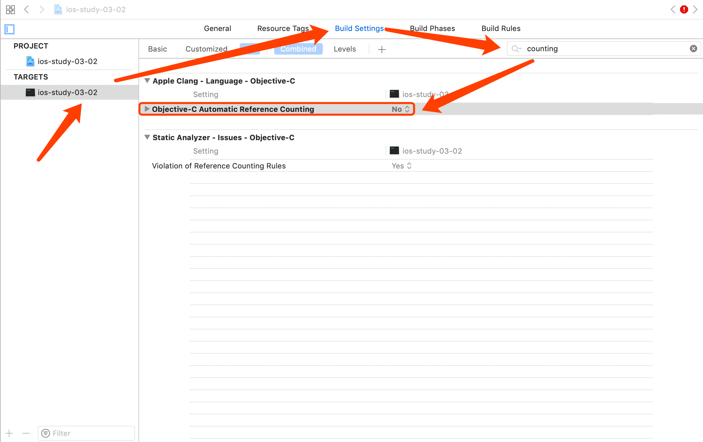
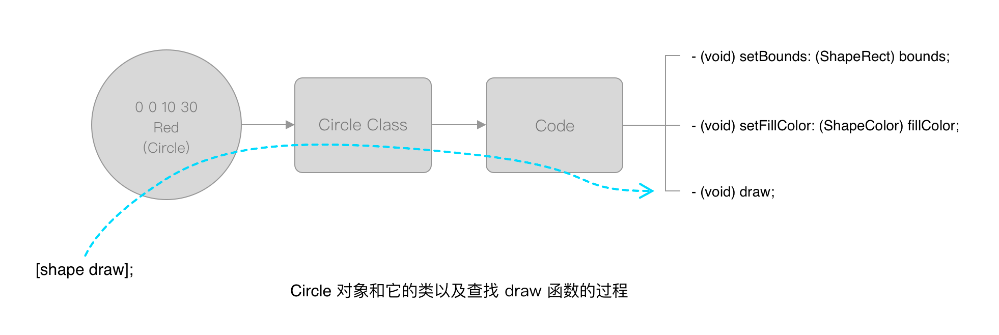

# 第三章 面向对象编程的基础知识
面向对象是一种编程架构（Object-Oriented Programming，后面简称 OOP），可编写由多个对象组成的软件。对象就好比是计算机中的零件，它们通过相互传递信息来完成工作。

## 3.1 间接
间接就是不要写死、灵活分层、抽象，让别人替你去做事。

### 3.1.1 变量与间接
使用变量而不是魔数（magic number），其他数据类型同理。

直接：
```Objective-C
#import <Foundation/Foundation.h>

int main (int argc, const char *argv[]) {
    NSLog(@"数字从 1 到 5:");

    for (int i = 1; i <= 5; i++) {
        NSLog(@"%d\n", i);
    }

    return 0;
}
```

间接：
```Objective-C
#import <Foundation/Foundation.h>

int main (int argc, const char *argv[]) {
    int count = 5;

    NSLog(@"数字从 1 到 %d:", count);

    for (int i = 1; i <= count; i++) {
        NSLog(@"%d\n", i);
    }

    return 0;
}
```

### 3.1.2 使用文件名的间接
使用输入（文件、网络、标准输入等）来代替写死在代码里面的数据。

## 3.2 在面向对象的编程中使用间接
面向过程编程中分别准备函数和数据，然后把数据传到合适的函数中进行处理。而在面向对象编程中是间接调用函数。

### 3.2.1 过程式编程
过程式编程中数据通常存储在简单的数据结构例如 struct 里，也有一些复杂的例如链表、树。当你调用一个函数时，将
数据传入函数，函数是过程式编程的中心，你决定调用哪个函数，传递其需要的数据。

过程式编程绘制图形示例（代码 ios-study-03-01）：
```Objective-C
#import <Foundation/Foundation.h>

// ====================
// 定义数据结构
// ====================

// 定义形状
typedef enum {
    kCircle,
    kRectangle,
    kOblateSpheroid
} ShapeType;

// 定义颜色
typedef enum {
    kRedColor,
    kGreenColor,
    kBlueColor
} ShapeColor;

// 定义形状区域
typedef struct {
    int x, y, width, height;
} ShapeRect;

// 定义图形
typedef struct {
    ShapeType type;
    ShapeColor fillColor;
    ShapeRect bounds;
} Shape;

// ====================
// 函数声明
// ====================

void drawShapes (Shape shapes[], int count);
void drawCircle (ShapeRect bounds, ShapeColor fillColor);
void drawRectangle (ShapeRect bounds, ShapeColor fillColor);
void drawEgg (ShapeRect bounds, ShapeColor fillColor);
NSString *colorName (ShapeColor colorName);

// ====================
// 函数定义
// ====================

void drawShapes (Shape shapes[], int count) {
    int i;
    
    for (i = 0; i < count; i++) {
        switch (shapes[i].type) {
            case kCircle:
                drawCircle(shapes[i].bounds, shapes[i].fillColor);
                break;
            case kRectangle:
                drawRectangle(shapes[i].bounds, shapes[i].fillColor);
                break;
            case kOblateSpheroid:
                drawEgg(shapes[i].bounds, shapes[i].fillColor);
        }
    }
}

void drawCircle (ShapeRect bounds, ShapeColor fillColor) {
    NSLog(@"绘制一个 (%d %d %d %d) %@色的圆",
          bounds.x, bounds.y,
          bounds.width, bounds.height,
          colorName(fillColor));
}

void drawRectangle (ShapeRect bounds, ShapeColor fillColor) {
    NSLog(@"绘制一个 (%d %d %d %d) %@色的矩形",
          bounds.x, bounds.y,
          bounds.width, bounds.height,
          colorName(fillColor));
}

void drawEgg (ShapeRect bounds, ShapeColor fillColor) {
    NSLog(@"绘制一个 (%d %d %d %d) %@色的椭圆",
          bounds.x, bounds.y,
          bounds.width, bounds.height,
          colorName(fillColor));
}

NSString *colorName (ShapeColor colorName) {
    switch (colorName) {
        case kRedColor:
            return @"红";
            break;
        case kGreenColor:
            return @"绿";
            break;
        case kBlueColor:
            return @"蓝";
            break;
    }
}

// ====================
// 程序入口
// ====================

int main (int argc, const char *argv[]) {
    Shape shapes[3];
    
    // 红色圆形
    ShapeRect rect0 = { 0, 0, 10, 30 };
    shapes[0].type = kCircle;
    shapes[0].fillColor = kRedColor;
    shapes[0].bounds = rect0;
    
    // 绿色矩形
    ShapeRect rect1 = { 30, 40, 50, 60 };
    shapes[1].type = kRectangle;
    shapes[1].fillColor = kGreenColor;
    shapes[1].bounds = rect1;
    
    // 蓝色椭圆
    ShapeRect rect2 = { 15, 25, 37, 30 };
    shapes[2].type = kOblateSpheroid;
    shapes[2].fillColor = kBlueColor;
    shapes[2].bounds = rect2;
    
    drawShapes(shapes, 3);
    
    return 0;
}
```

程序运行输出：
```
2019-05-30 15:27:46.755508+0800 ios-study-03-01[20187:19415205] 绘制一个 (0 0 10 30) 红色的圆
2019-05-30 15:27:46.755688+0800 ios-study-03-01[20187:19415205] 绘制一个 (30 40 50 60) 绿色的矩形
2019-05-30 15:27:46.755705+0800 ios-study-03-01[20187:19415205] 绘制一个 (15 25 37 30) 蓝色的椭圆
Program ended with exit code: 0
```

目前位置程序运行状况良好，但如果增加绘制新图形，就会发现一些问题：
* 新增图形需要修改多处代码
* 新增图形需要更多的数据结构来描述，这对其他图形不是必须的

### 3.2.2 实现面向对象编程
过程式编程与面向对象编程对比：
* 过程式编程建立在函数基础上，数据为函数服务
* 面向对象编程以相反的角度看待问题，以数据为中心，函数为数据服务，重心在数据

在 OOP 中不再是使用类似 drawRectangle() 函数绘制特定的图形，而是间接让图形绘制自身，每个对象都有自己的 draw() 函数，例如 rectangle 对象的 draw() 函数知道如何绘制矩形。

使用 OOP 改写后的图形绘制程序（代码 ios-study-03-02）：
```Objective-C
#import <Foundation/Foundation.h>

// ====================
// 定义数据结构
// ====================

// 定义形状
typedef enum {
    kCircle,
    kRectangle,
    kOblateSpheroid
} ShapeType;

// 定义颜色
typedef enum {
    kRedColor,
    kGreenColor,
    kBlueColor
} ShapeColor;

// 定义形状区域
typedef struct {
    int x, y, width, height;
} ShapeRect;

// 定义图形
typedef struct {
    ShapeType type;
    ShapeColor fillColor;
    ShapeRect bounds;
} Shape;

// ====================
// 函数声明
// ====================

void drawShapes (id shapes[], int count);
NSString *colorName (ShapeColor colorName);

// ====================
// 函数定义
// ====================

void drawShapes (id shapes[], int count) {
    for (int i = 0 ; i < count; i++) {
        id shape = shapes[i];
        [shape draw];
    }
}

NSString *colorName (ShapeColor colorName) {
    switch (colorName) {
        case kRedColor:
            return @"红";
            break;
        case kGreenColor:
            return @"绿";
            break;
        case kBlueColor:
            return @"蓝";
            break;
    }
}

// ====================
// 类声明
// ====================

@interface Circle : NSObject
{
    ShapeRect bounds;
    ShapeColor fillColor;
}

- (void) setBounds: (ShapeRect) bounds;

- (void) setFillColor: (ShapeColor) fillColor;

- (void) draw;

@end

@interface Rectangle : NSObject
{
    ShapeRect bounds;
    ShapeColor fillColor;
}

- (void) setBounds: (ShapeRect) bounds;

- (void) setFillColor: (ShapeColor) fillColor;

- (void) draw;

@end

@interface Egg : NSObject
{
    ShapeRect bounds;
    ShapeColor fillColor;
}

- (void) setBounds: (ShapeRect) bounds;

- (void) setFillColor: (ShapeColor) fillColor;

- (void) draw;

@end

// ====================
// 类实现
// ====================

@implementation Circle

- (void) setBounds: (ShapeRect) _bounds {
    bounds = _bounds;
};

- (void) setFillColor: (ShapeColor) _fillColor {
    fillColor = _fillColor;
};

- (void) draw {
    NSLog(@"绘制一个 (%d %d %d %d) %@色的圆",
          bounds.x, bounds.y,
          bounds.width,bounds.height,
          colorName(fillColor));
}

@end

@implementation Rectangle : NSObject

- (void) setBounds: (ShapeRect) _bounds {
    bounds = _bounds;
};

- (void) setFillColor: (ShapeColor) _fillColor {
    fillColor = _fillColor;
};

- (void) draw {
    NSLog(@"绘制一个 (%d %d %d %d) %@色的矩形",
          bounds.x, bounds.y,
          bounds.width, bounds.height,
          colorName(fillColor));
}

@end

@implementation Egg : NSObject

- (void) setBounds: (ShapeRect) _bounds {
    bounds = _bounds;
};

- (void) setFillColor: (ShapeColor) _fillColor {
    fillColor = _fillColor;
};

- (void) draw {
    NSLog(@"绘制一个 (%d %d %d %d) %@色的椭圆",
          bounds.x, bounds.y,
          bounds.width, bounds.height,
          colorName(fillColor));
}

@end

// ====================
// 程序入口
// ====================

int main (int argc, const char *argv[]) {
    id shapes[3];
    
    // 红色圆形
    ShapeRect rect0 = { 0, 0, 10, 30 };
    shapes[0] = [Circle new];
    [shapes[0] setBounds: rect0];
    [shapes[0] setFillColor: kRedColor];
    
    // 绿色矩形
    ShapeRect rect1 = { 30, 40, 50, 60 };
    shapes[1] = [Rectangle new];
    [shapes[1] setBounds: rect1];
    [shapes[1] setFillColor: kGreenColor];
    
    // 蓝色扁球
    ShapeRect rect2 = { 15, 25, 37, 30 };
    shapes[2] = [Egg new];
    [shapes[2] setBounds: rect2];
    [shapes[2] setFillColor: kBlueColor];
    
    drawShapes(shapes, 3);
    
    return 0;
}
```
执行以上代码需要对 Xcode 的项目编译选项进行设置：


代码解读

* `id shapes[3]`：其中 `id` 是泛型，表示可以接受任意类型对象，实际上是一个指针
* `[shape draw]`：在 OC 中叫做向 shape 对象发送 draw 消息，在其他 OOP 语言中也叫做调用 shape 对象的 draw 方法。这里并不仅仅是叫法不同，而内部实现也不同，OC 中是向对象发送消息，然后运行时查找是否在类中定义过此函数，然后再执行

    
* 其他不懂的地方将会在本章后续内容进行详细说明

## 3.3 有关术语
OC 相关的一些术语：
* 类（class）：是一种表示对象类型的结构体。对象通过它的类来获取自身的各种信息，尤其是执行每个操作需要运行的代码
* 对象（object）：是一种包含值和指向其类的隐藏指针的结构体
* 实例（instance）：对象的另一种称呼，例如 circle 对象是 Circle 类的实例
* 消息（message）：是对象可以执行的操作，用于通知对象去做什么，对象在接收到消息后将查询对应的类，以便找到正确的代码来运行
* 方法（method）：为了响应消息而执行的代码
* 方法调度（method dispatcher）：OC 的一种机制，用于推测执行什么方法以响应某个特定的消息，后面会有章节专门讲解 OC 方法调度机制
* 接口（interface）：是类为对象提供的的特性描述
* 实现（implementation）：是使接口能正常工作的代码，实际就是类的具体实现代码

## 3.4 Objective-C 语言中的 OOP
### 3.4.1 @interface 部分
在 OC 中看到 `@` 前缀通常情况都是对 C 语言的扩展，可以认为是 OC 新增特性

```Objective-C
// @interface 编译器指令，表示接口定义开始，创建一个类之前编译器需要知道一个类的相关信息
// Circle : NSObject 冒号表示继承，在 OC 中所有的类都继承自 NSObject
@interface Circle : NSObject
// 实例变量声明
{
    ShapeRect bounds;
    ShapeColor fillColor;
}

// 方法声明
// - 代表是实例方法，+ 代表是类方法或者静态方法
// (void) 是方法返回值类型，void 表示不返回任何值
// setBounds 是方法名，冒号后面是参数
// (ShapeRect) 是参数类型
// bounds 是参数名字
- (void) setBounds: (ShapeRect) bounds;

- (void) setFillColor: (ShapeColor) fillColor;

- (void) draw;

// @end 表示接口定义结束
@end
```

### 3.4.2 @implementation 部分
@interface 用于定义公共接口，而真正使对象运行起来的代码在 @implementation 部分

```Objective-C
// @implementation 是编译器指令，表示将为某个类提供实现代码
// Circle 是类名
@implementation Circle

// bounds 是 @interface 部分定义过的成员，所以方法参数改名为 _bounds 以免冲突
// OC 在调用方法时会将对象以 self 隐藏参数形式传递给方法，bounds 即 self.bounds
- (void) setBounds: (ShapeRect) _bounds {
    bounds = _bounds;
};

- (void) setFillColor: (ShapeColor) _fillColor {
    fillColor = _fillColor;
};

- (void) draw {
    NSLog(@"绘制一个 (%d %d %d %d) %@色的圆",
          bounds.x, bounds.y,
          bounds.width, bounds.height,
          colorName(fillColor));
}

@end
```

### 3.4.3 实例化对象
通过类创建对象的过程叫实例化（instantiation），实例化对象时需要分配内存，这些内存被分配并保存了一些默认值之后就形成了对象实例。

对象的局部变量也称作实例变量，通常简写为 `ivars`。

OC 中可以向类发送消息，创建实例时向类发送 new 消息，该类接收到并处理完 new 消息后，我们就会得到一个可以使用的新对象实例。

```Objective-C
id shapes[3];

ShapeRect rect0 = { 0, 0, 10, 30 };

// 实例化 circle 对象
// 向 Circle 类发送 new 消息
shapes[0] = [Circle new];
[shapes[0] setBounds: rect0];
[shapes[0] setFillColor: kRedColor];
```