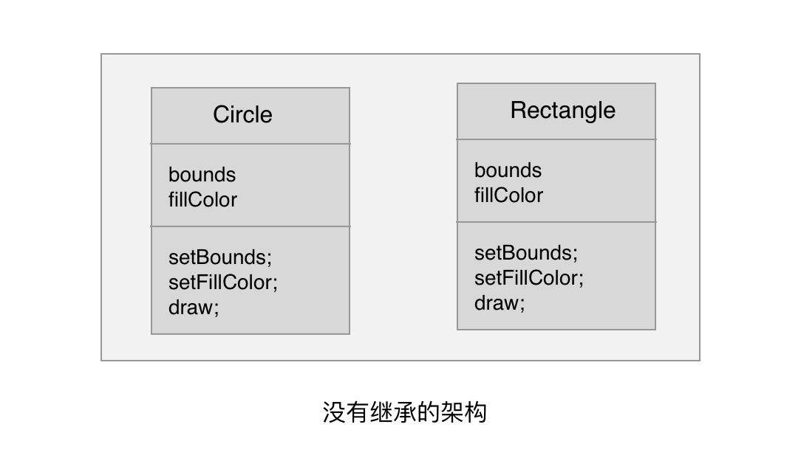
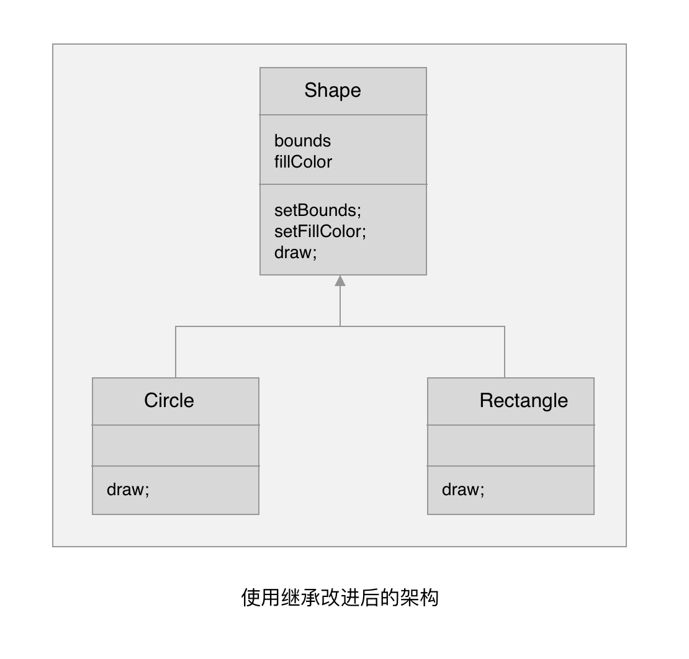
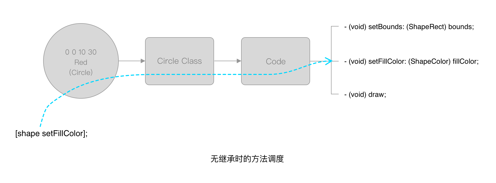
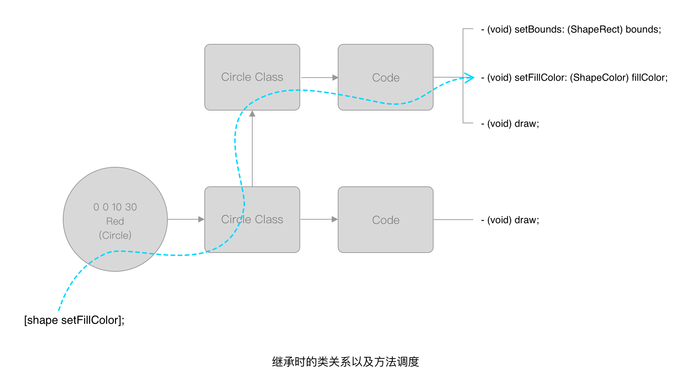
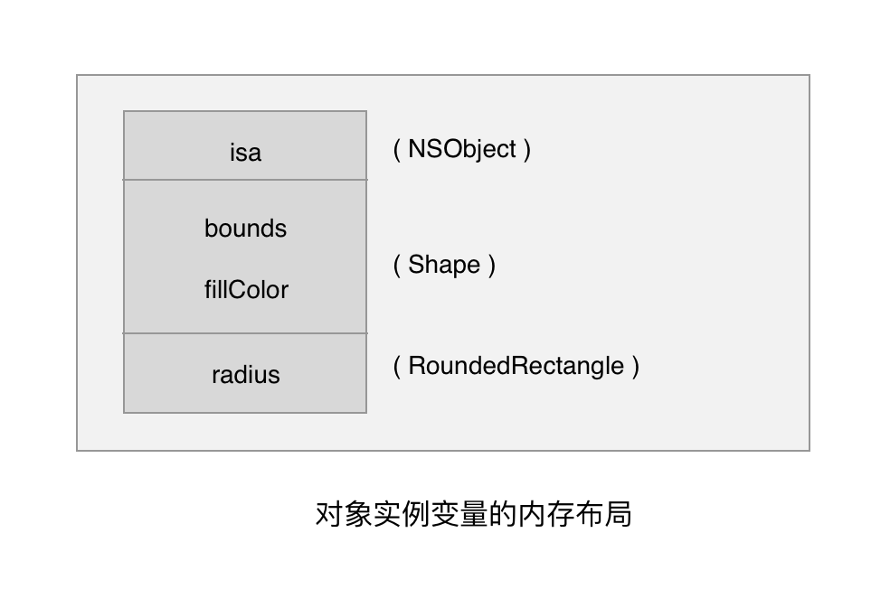
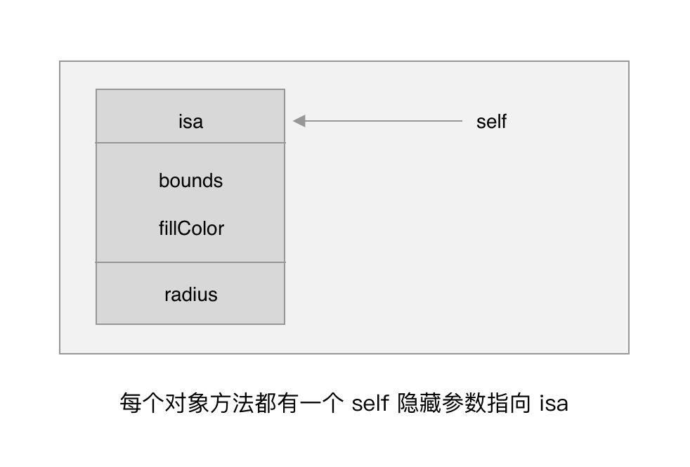
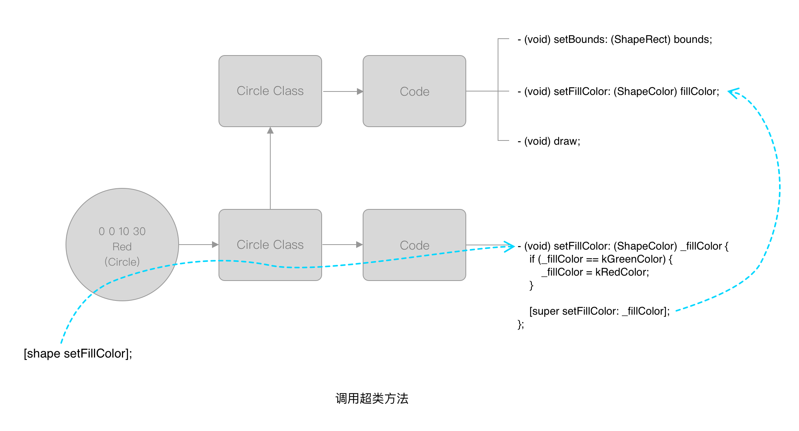

# 第四章 继承

## 4.1 为何使用继承
一起看看上一章的 ios-study-03-02 的代码：

```Objective-C
@interface Circle : NSObject
{
    ShapeRect bounds;
    ShapeColor fillColor;
}

- (void) setBounds: (ShapeRect) bounds;

- (void) setFillColor: (ShapeColor) fillColor;

- (void) draw;

@end

@interface Rectangle : NSObject
{
    ShapeRect bounds;
    ShapeColor fillColor;
}

- (void) setBounds: (ShapeRect) bounds;

- (void) setFillColor: (ShapeColor) fillColor;

- (void) draw;

@end
```

关注点：
* 除了类名不同，其他部分都相同
* setBounds、setFillColor 的具体实现完全相同
* draw 的实现不同

带来的问题是需要维护多份内容相同的代码。





## 4.2 继承语法
以下面声明一个类的代码为例子：
* 冒号左边为自定义的新类名字
* 冒号右边为被继承的类

```Objective-C
@interface Circle : NSObject
```

使用继承修改 ios-study-03-02 代码（代码 ios-study-04-01）：
```Objective-C
//
//  main.m
//  ios-study-04-01
//
//  Created by roryluo-mb on 2019/5/31.
//  Copyright © 2019 ios-study. All rights reserved.
//

#import <Foundation/Foundation.h>

// ====================
// 定义数据结构
// ====================

// 定义形状
typedef enum {
    kCircle,
    kRectangle,
    kOblateSpheroid
} ShapeType;

// 定义颜色
typedef enum {
    kRedColor,
    kGreenColor,
    kBlueColor
} ShapeColor;

// 定义形状区域
typedef struct {
    int x, y, width, height;
} ShapeRect;

// ====================
// 函数声明
// ====================

void drawShapes (id shapes[], int count);
NSString *colorName (ShapeColor colorName);

// ====================
// 函数定义
// ====================

void drawShapes (id shapes[], int count) {
    for (int i = 0 ; i < count; i++) {
        id shape = shapes[i];
        [shape draw];
    }
}

NSString *colorName (ShapeColor colorName) {
    switch (colorName) {
        case kRedColor:
            return @"红";
            break;
        case kGreenColor:
            return @"绿";
            break;
        case kBlueColor:
            return @"蓝";
            break;
    }
}

// ====================
// 类声明
// ====================

@interface Shape : NSObject
{
    ShapeRect bounds;
    ShapeColor fillColor;
}

- (void) setBounds: (ShapeRect) bounds;

- (void) setFillColor: (ShapeColor) fillColor;

- (void) draw;

@end

@interface Circle : Shape
@end

@interface Rectangle : Shape
@end

@interface Egg : Shape
@end

// ====================
// 类实现
// ====================

@implementation Shape

- (void) setBounds: (ShapeRect) _bounds {
    bounds = _bounds;
};

- (void) setFillColor: (ShapeColor) _fillColor {
    fillColor = _fillColor;
};

- (void) draw {
    
}

@end

@implementation Circle

- (void) draw {
    NSLog(@"绘制一个 (%d %d %d %d) %@色的圆",
          bounds.x, bounds.y,
          bounds.width,bounds.height,
          colorName(fillColor));
}

@end

@implementation Rectangle

- (void) draw {
    NSLog(@"绘制一个 (%d %d %d %d) %@色的矩形",
          bounds.x, bounds.y,
          bounds.width, bounds.height,
          colorName(fillColor));
}

@end

@implementation Egg

- (void) draw {
    NSLog(@"绘制一个 (%d %d %d %d) %@色的椭圆",
          bounds.x, bounds.y,
          bounds.width, bounds.height,
          colorName(fillColor));
}

@end

// ====================
// 程序入口
// ====================

int main (int argc, const char *argv[]) {
    id shapes[3];
    
    // 红色圆形
    ShapeRect rect0 = { 0, 0, 10, 30 };
    shapes[0] = [Circle new];
    [shapes[0] setBounds: rect0];
    [shapes[0] setFillColor: kRedColor];
    
    // 绿色矩形
    ShapeRect rect1 = { 30, 40, 50, 60 };
    shapes[1] = [Rectangle new];
    [shapes[1] setBounds: rect1];
    [shapes[1] setFillColor: kGreenColor];
    
    // 蓝色椭圆
    ShapeRect rect2 = { 15, 25, 37, 30 };
    shapes[2] = [Egg new];
    [shapes[2] setBounds: rect2];
    [shapes[2] setFillColor: kBlueColor];
    
    drawShapes(shapes, 3);
    
    return 0;
}
```

相关术语：
* 超类（superclass）/ 父类（parentclass）：所继承的类，以上例子中的 Shape 类
* 子类（subclass） / 孩子类（childclass）：实施继承的类，以上例子中的 Circle 类
* 重写（override）：子类覆盖超类方法，例如 Circle 类重写了 draw 方法

## 4.3 继承的工作机制
### 4.3.1 方法调度
向对象发送消息时，OC 的方法调度程序将在当前对象指向的类中搜索相应的方法，如果当前类中没有，就会去超类中搜索，如果直到最高级别的超类中仍然没有所有到对应的方法，就会出现运行时错误（编译时也会有警告）。





### 4.3.2 实例变量
创建一个新类时，其对象首先从自身的超类中继承实例变量，然后添加它们自己的实例变量。

```Objective-C
@interface Shape : NSObject
{
    ShapeRect bounds;
    ShapeColor fillColor;
}

- (void) setBounds: (ShapeRect) bounds;

- (void) setFillColor: (ShapeColor) fillColor;

- (void) draw;

@end

@interface RoundedRectangle : Shape
{
    int radius;
}

@end
```

实例变量的内存布局：



* `NSObject` 声明了一个名为 `isa` 的实例变量，该变量保存了一个指针指向对象的类
* 接下来 `Shape` 声明了两个实例变量 `bounds` `fillColor`
* 最后 `RoundedRectangle` 声明了实例变量 `radius`

> 说明：继承表达了子类和超类建立了 "is a" 的关系，所以 NSObject 的实例变量起名 isa。

> 说明：编译器使用“基址 + 偏移”来查找实例变量。

实例方法中的 self 隐藏参数：



## 4.4 重写方法
示例代码 ios-study-04-01 中 Shape 定义了空的 draw 方法，它的子类 Circle 定义了具体的 draw 方法并拥有自己独特的实现代码，这就是重写。可以把 Shape 的 draw 看作抽象方法。

向 Circle 实例发送 draw 消息时，根据方法调度机制会执行 Circle 重写的 draw 方法，不会执行 Shape 定义的 draw 方法。

```Objective-C
@implementation Shape

- (void) setBounds: (ShapeRect) _bounds {
    bounds = _bounds;
};

- (void) setFillColor: (ShapeColor) _fillColor {
    fillColor = _fillColor;
};

// 可以看作抽象方法
- (void) draw {
    
}

@end

@implementation Circle

// 重写方法（具体实现在这里）
- (void) draw {
    NSLog(@"绘制一个 (%d %d %d %d) %@色的圆",
          bounds.x, bounds.y,
          bounds.width,bounds.height,
          colorName(fillColor));
}

@end
```

`super` 关键字

OC 提供了 super 关键字，可以在子类的方法中显示调用超类中的方法，向 super 发送消息等价于对超类发送消息。

重写超类方法并通过 super 调用超类方法的例子：
```Objective-C
@implementation Circle

- (void) setFillColor: (ShapeColor) _fillColor {
    // 因需求变更，所有圆形填充绿色的逻辑全部改为填充红色
    if (_fillColor == kGreenColor) {
        _fillColor = kRedColor;
    }

    [super setFillColor: _fillColor];
};

@end
```

