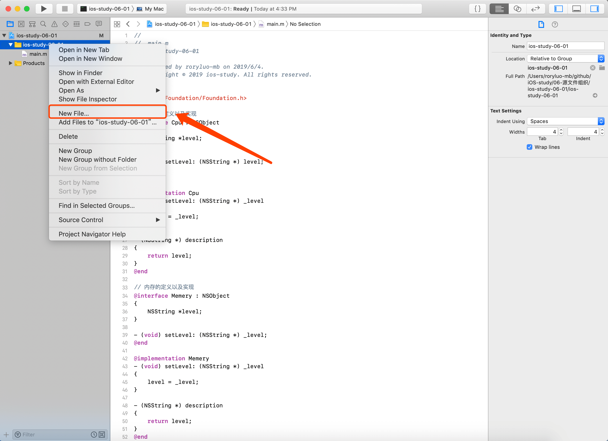
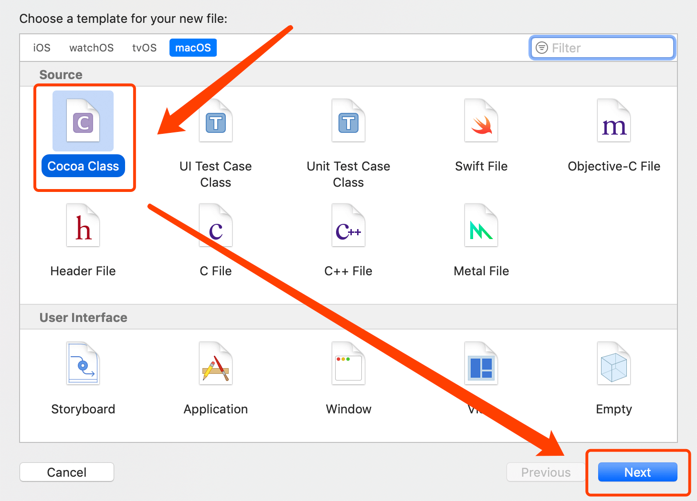
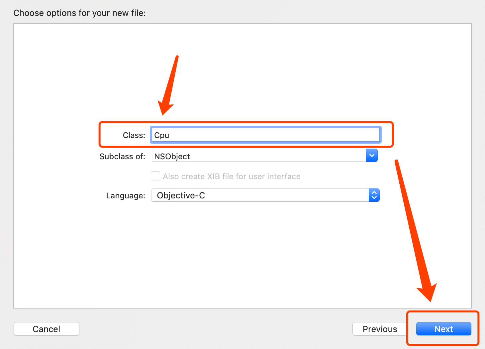
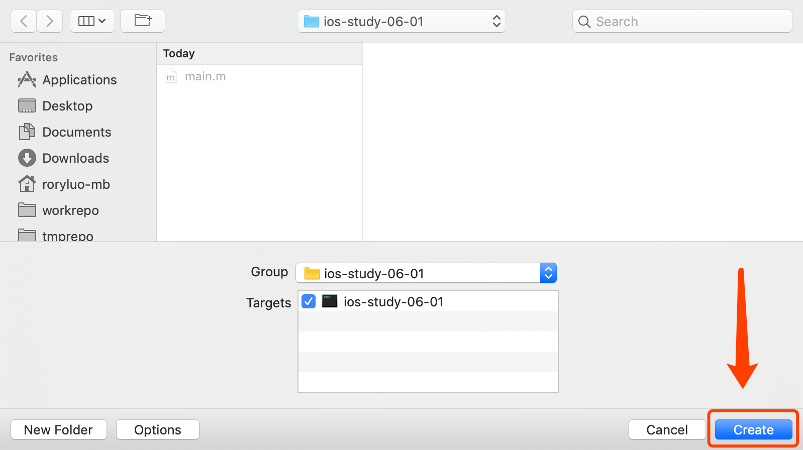
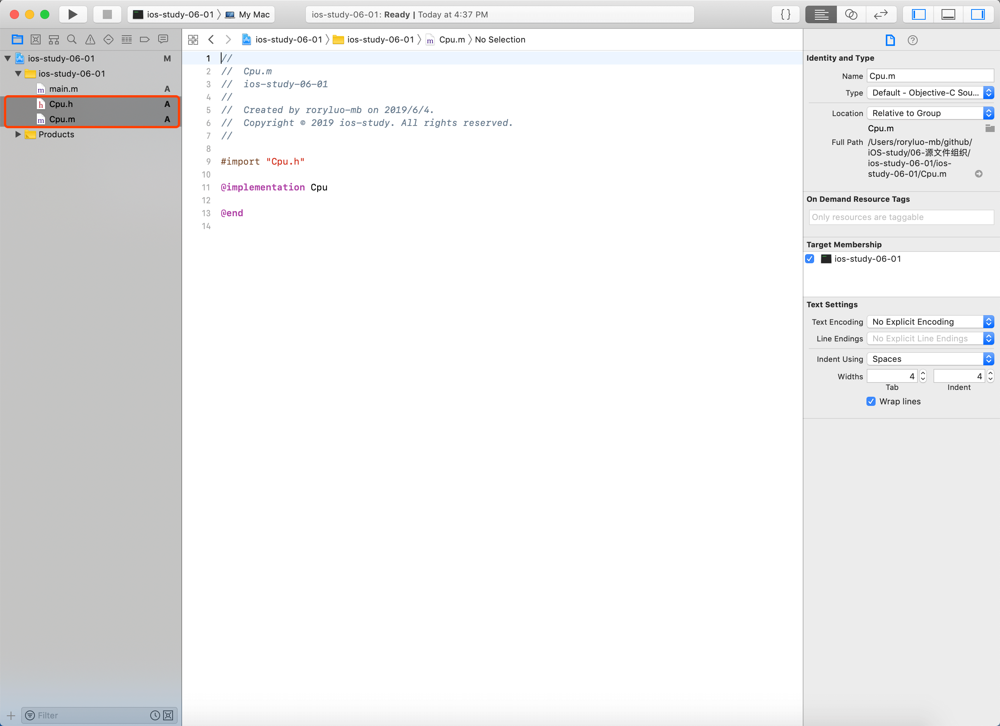
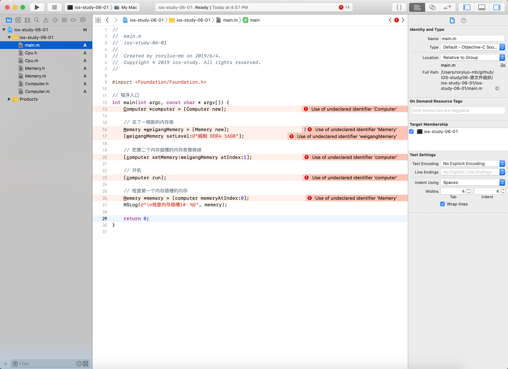

# 第六章 源文件组织
之前我们所有的代码都放在 `main.m` 文件中，这对于代码简短的 demo 来说没什么问题，实际工程中是不会把所有代码都写到一个文件里的。

## 6.1 拆分接口和实现部分
* 类文件拆分：`@interface` 部分放入头文件（即 `.h` 文件），`@implementation` 部分放入主文件（即 `.m` 文件）
* 头文件包含内容：类的 `@interface` 指令，公共 `struct` 定义，`enum` 常量，`#defines` 和 `extern` 全局变量
* 主文件包含内容：类的 `@implementation` 指令，全局变量的定义，私有 `struct` 等

使用 Xcode 创建文件：

1. 在项目导航中右键新建文件：
    

2. 新建 `Cocoa Class` 文件：
    

3. 填写 class 名字、选择父类：
    

4. 选择放置源码文件的目录：
    

5. 最终生成了 `.h` 和 `.m` 两个文件：
    

## 6.2 拆分 Computer 程序
按照 6.1 新建文件的方式将第五章 `ios-study-05-01` 项目的 main.m 中所有的类拆分开来。

* `Cpu` 类拆分为 `Cpu.h` 和 `Cpu.m` 两个文件
* `Memery` 类拆分为 `Memery.h` 和 `Memery.m` 两个文件
* `Computer` 类拆分为 `Computer.h` 和 `Computer.m` 两个文件

Cpu.h 文件内容：
```Objective-C
#import <Foundation/Foundation.h>

NS_ASSUME_NONNULL_BEGIN

@interface Cpu : NSObject
{
    NSString *level;
}

- (void) setLevel: (NSString *) level;

@end

NS_ASSUME_NONNULL_END
```

Cpu.m 文件内容：
```Objective-C
#import "Cpu.h"

@implementation Cpu
- (void) setLevel: (NSString *) _level
{
    level = _level;
}

- (NSString *) description
{
    return level;
}
@end
```

拆分完成之后的项目：
    

直接把代码拆开仍然不能正确编译项目，应将其他头文件声明的类引入当前文件，例如 `main.m` 需要添加以下指令：
```Objective-C
#import "Cpu.h"
#import "Memery.h"
#import "Computer.h"
```

此外 `Computer.h`、`Computer.m` 也需要添加对应的 `#import` 指令代码。

## 6.3 使用夸文件依赖关系
* 使用 `#import` 指令导入依赖会在文件之间建立强关联，被依赖文件改变时，当前文件也需要重编译
* 依赖具有传递性，例如 `Obj1.h` 依赖 `Obj2.h`，而 `Obj2.h` 依赖 `Obj3.h`，则 `Obj3.h` 发生任何变化都需要重编译前面提到的文件
* Xcode 帮你记录了所有的依赖关系

### 6.3.1 重新编译须知
为了减少这种重编译带来的影响，可以在 `.h` 文件中使用 `@class` 指令代替 `#import`。告诉编译器暂时不需要知道当前文件依赖的类具体实现，而是在编译时会知道（因为 `.m` 中有引入）。

Computer.h 第一版
```Objective-C
#import <Foundation/Foundation.h>
#import "Cpu.h"
#import "Memery.h"
#import "Computer.h"

NS_ASSUME_NONNULL_BEGIN

@interface Computer : NSObject
{
    Cpu *cpu;
    Memery *memery[2];
}

- (Cpu *) cpu;

- (void) setCpu: (Cpu *) cpu;

- (Memery *) memeryAtIndex: (int) index;

- (void) setMemery: (Memery *) memery atIndex: (int) index;

- (void) run;

@end

NS_ASSUME_NONNULL_END

```

Computer.h 第二版
```Objective-C
#import <Foundation/Foundation.h>

NS_ASSUME_NONNULL_BEGIN

@class Cpu;
@class Memery;
@interface Computer : NSObject
{
    Cpu *cpu;
    Memery *memery[2];
}

- (Cpu *) cpu;

- (void) setCpu: (Cpu *) cpu;

- (Memery *) memeryAtIndex: (int) index;

- (void) setMemery: (Memery *) memery atIndex: (int) index;

- (void) run;

@end

NS_ASSUME_NONNULL_END

```

### 6.3.2 导入和继承
如果一个类继承自另一个类，则 `.h` 中不能使用 `@class` 代替 `#import`。